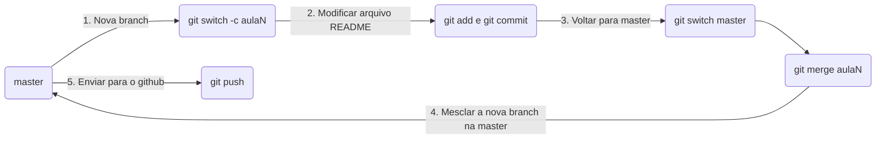

> Objetivo da aula: criar o primeiro repositório no github para subir o conteúdo das aulas anteriores e aprender como enviar os commits do repositório local para um repositório remoto. 

### O que foi exercitado em sala
Com o repositório local devidamente configurado com o repositório remoto, foi solicitado atualizar os README de cada aula usando o seguinte fluxo:

O objetivo desse fluxo é fixar melhor o motivo de fazer alterações em branches separadas em vez de alterar e "commitar" diretamente na master.

### Comandos GIT visto em aula
- git remote
- git remote add **name URL**
- git remote update
- git remote remove
- git branch
- git branch **name**
- git branch --remotes
- git branch --delete **name**
- git add **diretorio/**
- git add **diretorio/arquivo.***
- git commit --amend
- git switch **branch**
- git switch --create **nova-branch**
- git push --set-upstream
